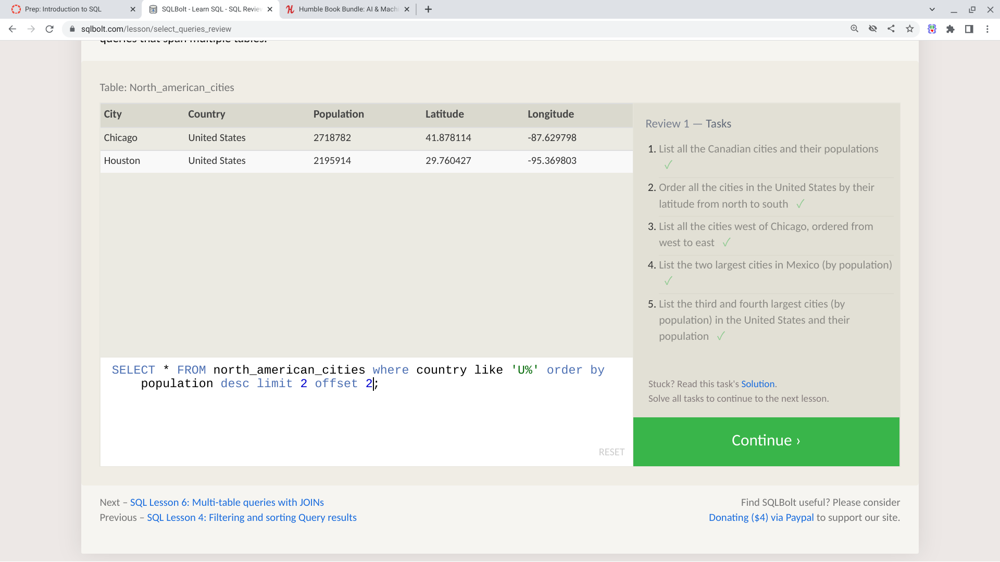

# SQL Practice
*This is a summary, mostly from [SQLBolt](sqlbolt.com)*

Structured Query Language (SQL) is a search language to instruct a relational database what information to retrieve.

*There are many popular SQL databases including SQLite, MySQL, Postgres, Oracle and Microsoft SQL Server. All of them support the SQL language standard.*

A relational database is a collection of related tables.

SCHEMA describes a collection of tables and their relationships in the database.

### Queries

- *Each query statement ends with a semi-colon.*
- *SQL doesn't require capitalized keywords, but it is a convention that helps distinguish SQL keywords from column and tables names.*
- *All strings must be quoted so that the query parser can distinguish words in the string from SQL keywords.*

SELECT - first instruction of any SQL statement that’s fetching data.

FROM - specifies the table

`SELECT [column(s)] FROM [table];`

/* Splat is a shortcut to get all columns.

ORDER BY [desired column] ASC / DESC (ending)

LIMIT - max number of results

`SELECT * FROM [table] LIMIT [number of results];`

WHERE - filters results that meet condition(s)

`SELECT * FROM [table] WHERE [Filter Conditions];`

AND - Requiring Multiple Conditions
OR - Requiring Any Condition
NOT -  invert a condition
BETWEEN … AND … - Number is within a range (inclusive)
IN(...) - Number exists in a list
Operators: = < > <= >= != <>

*Use parenthesis to specify the order of operations*

**String operators and Patterns**
LIKE - string matches a pattern
ILIKE  - case insensitive version of LIKE
SIMILAR TO - string matches a regex pattern

IS NULL - NULL values
IS NOT NULL - non NULL values

**Functions**
Some of the most commonly used functions in SQL.

MAX - largest (maximum) number in a set
MIN - smllest number in a set
COUNT - # of values in a set
COUNT DISTINCT - # of unique (distinct) values in a set
EVERY - true if all data inside is true (same as bool_and)
AVG - average (mean) of a set of numbers
SUM - sum all values in a set

DISTINCT - blindly remove duplicate rows

*Example*
SELECT column, another_column,
FROM mytable
WHERE condition(s)
ORDER BY column ASC/DESC
LIMIT num_limit OFFSET num_offset;

### Multi-table queries with JOINs

*Data is often broken down into pieces and stored across multiple orthogonal tables using a process known as normalization, which minimizes duplicate data in any single table, and allows for data in the database to grow independently of each other.*

INNER JOIN - matches rows from the first table and the second table which have the same key (as defined by the ON constraint) to create a result row with the combined columns from both tables.

### Insert, Update and Delete data

INSERT - declares which table to write into, the columns of data that we are filling, and one or more rows of data to insert. In general, each row of data inserted should contain values for every column in the table. Insert multiple rows by listing them sequentially.

UPDATE - updates existing data; must specify exactly which table, columns, and rows to update.

DELETE - delete table data by specifying the rows to delete through the WHERE clause.

### Create table

CREATE TABLE - create new entities and relationships to store in your database

If a table with the same name already exists, SQL will usually throw an error; to suppress the error and skip creating a table if one exists, use the IF NOT EXISTS clause.

CREATE TABLE IF NOT EXISTS mytable (
    column DataType TableConstraint DEFAULT default_value,
    another_column DataType TableConstraint DEFAULT default_value
);

DataType -NTEGER, BOOLEAN, FLOAT, TEXT, DATE, etc.

TableConstraint -PRIMARY KEY (must be unique), AUTOINCREMENT, UNIQUE, NOT NULL, CHECK (expression), FOREIGN KEY (ensures each value in column corresponds to another value in a column in another table)

### Modify table

ALTER TABLE - add, remove, or modify columns and table constraints.

Add new column by specifying the data type of the column along with any potential constraints and default values for both existing and new rows.

ALTER TABLE mytable
ADD column DataType OptionalTableConstraint 
    DEFAULT default_value;

Remove a column by specifying the column to drop. (Some databases like SQLite don't support this feature. Instead you may have to create a new table and migrate the data over.)

ALTER TABLE mytable
DROP column_to_be_deleted;

### Drop table

DROP TABLE - different from DELETE, it also removes the table schema from the database entirely.  It may throw an error if the table does not exist; suppress that error, by using IF EXISTS clause.

DROP TABLE IF EXISTS mytable;

---

[Back to table of contents](../README.md)

---

*Screenshots for exercises 1-6 and 13-18*

